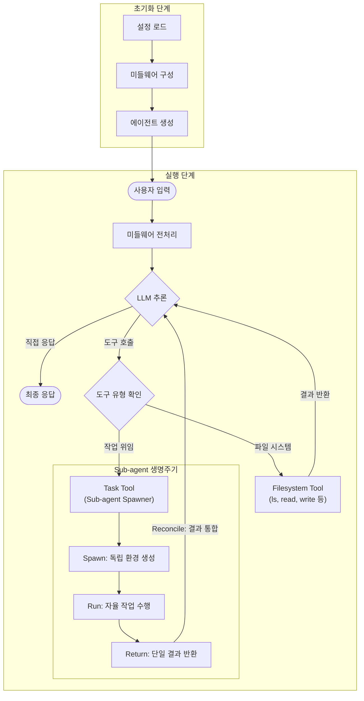

# Deep Agent 동작 흐름 및 아키텍처 분석

Deep Agent는 LangChain과 LangGraph를 기반으로 구축된 고도화된 에이전트 시스템입니다. 이 문서는 Deep Agent의 핵심 아키텍처와 동작 흐름을 설명합니다.

## 1. 핵심 아키텍처 (Core Architecture)

Deep Agent의 핵심은 `create_deep_agent` 함수(`libs/deepagents/deepagents/graph.py`)에 있습니다. 이 함수는 표준 LangChain 에이전트를 생성하되, 강력한 기능을 제공하기 위해 여러 **미들웨어(Middleware)**를 계층적으로 구성합니다.

### 주요 컴포넌트

1.  **Middleware System**: 에이전트의 입출력 및 기능을 확장하는 핵심 메커니즘입니다.
    -   `TodoListMiddleware`: 에이전트가 할 일 목록(Todo)을 관리할 수 있게 합니다.
    -   `FilesystemMiddleware`: 파일 시스템 접근 권한(읽기, 쓰기, 수정, 검색 등)을 제공합니다.
    -   `SubAgentMiddleware`: 복잡한 작업을 하위 에이전트(Sub-agent)에게 위임할 수 있는 기능을 제공합니다.
    -   `SummarizationMiddleware`: 대화 내용이 길어질 경우 자동으로 요약하여 컨텍스트 윈도우를 관리합니다.
    -   `AnthropicPromptCachingMiddleware`: Anthropic 모델 사용 시 프롬프트 캐싱을 통해 비용과 속도를 최적화합니다.

2.  **Backend System**: 파일 시스템 및 실행 환경을 추상화합니다.
    -   `StateBackend`: 에이전트 상태(State) 내에 임시로 파일을 저장합니다 (Ephemeral).
    -   `StoreBackend`: 영구 저장소에 파일을 저장합니다.
    -   `SandboxBackendProtocol`: 실제 쉘 명령어 실행을 지원하는 백엔드 인터페이스입니다.

## 2. 동작 흐름 (Operational Flow)

Deep Agent의 실행 과정은 크게 **초기화(Initialization)**와 **실행(Execution)** 단계로 나뉩니다.

### 2.1 초기화 단계 (Initialization)

1.  **설정 로드**: 모델(기본값: Claude Sonnet 4), 도구(Tools), 시스템 프롬프트 등을 설정합니다.
2.  **미들웨어 구성**:
    -   `FilesystemMiddleware`가 초기화되며, 지정된 백엔드(Backend)에 연결된 파일 시스템 도구들(`ls`, `read_file`, `write_file`, `edit_file`, `glob`, `grep`, `execute`)을 생성합니다.
    -   `SubAgentMiddleware`가 초기화되며, 하위 에이전트들을 위한 그래프를 컴파일하고 `task` 도구를 생성합니다.
3.  **에이전트 생성**: LangChain의 `create_agent`를 통해 위에서 구성된 요소들을 하나로 묶은 `CompiledStateGraph`를 반환합니다.

### 2.2 실행 단계 (Execution)

사용자가 메시지를 보내면 다음과 같은 흐름으로 처리됩니다:

1.  **입력 처리**: 사용자 입력이 들어오면 미들웨어 체인을 통과하며 필요한 전처리가 수행됩니다 (예: 시스템 프롬프트에 도구 설명 추가).
2.  **추론 (Reasoning)**: LLM이 현재 상황과 도구들을 바탕으로 다음 행동을 결정합니다.
3.  **도구 실행 (Tool Execution)**:
    -   **파일 조작**: `FilesystemMiddleware`가 제공한 도구를 통해 파일을 읽거나 씁니다.
    -   **작업 위임 (Delegation)**: 복잡한 작업인 경우 `task` 도구를 호출하여 **Sub-agent**를 실행합니다.
4.  **Sub-agent 실행**:
    -   `task` 도구가 호출되면, 독립적인 컨텍스트를 가진 새로운 에이전트(Sub-agent)가 생성됩니다.
    -   Sub-agent는 메인 에이전트와 격리된 상태에서 주어진 작업을 수행합니다.
    -   작업이 완료되면 최종 결과만을 메인 에이전트에게 반환합니다. 이를 통해 메인 에이전트의 컨텍스트 오염을 방지하고 토큰을 절약합니다.
5.  **결과 통합 및 응답**: 도구 실행 결과들이 다시 LLM에게 전달되고, 최종적으로 사용자에게 응답을 생성하거나 추가 작업을 수행합니다.

## 3. 주요 기능 상세 (Key Features)

### Sub-agent (하위 에이전트)
-   **목적**: 복잡하고 다단계가 필요한 작업을 격리된 환경에서 처리하여 메인 에이전트의 부하를 줄임.
-   **동작**: `task` 도구를 통해 호출되며, "Spawn(생성) -> Run(실행) -> Return(반환) -> Reconcile(통합)"의 생명주기를 가집니다.
-   **유형**: 범용 에이전트(General Purpose) 또는 특정 목적(예: 리서치, 코딩)에 특화된 커스텀 에이전트를 사용할 수 있습니다.

### Filesystem (파일 시스템)
-   **유연성**: 실제 로컬 파일 시스템뿐만 아니라, 메모리 상의 가상 파일 시스템이나 샌드박스 환경 등 다양한 백엔드를 지원합니다.
-   **도구**: 단순 읽기/쓰기 외에도 `grep`, `glob` 같은 검색 도구와 `edit_file` 같은 정교한 편집 도구를 제공합니다.

---
이 문서는 Deep Agent의 소스 코드(`libs/deepagents`) 분석을 바탕으로 작성되었습니다.

## 4. 동작 흐름 시각화 (Flow Visualization)

다음은 Deep Agent의 전체적인 동작 흐름을 나타낸 다이어그램입니다.

